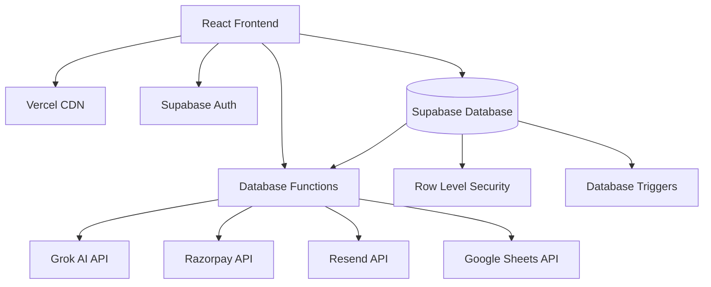
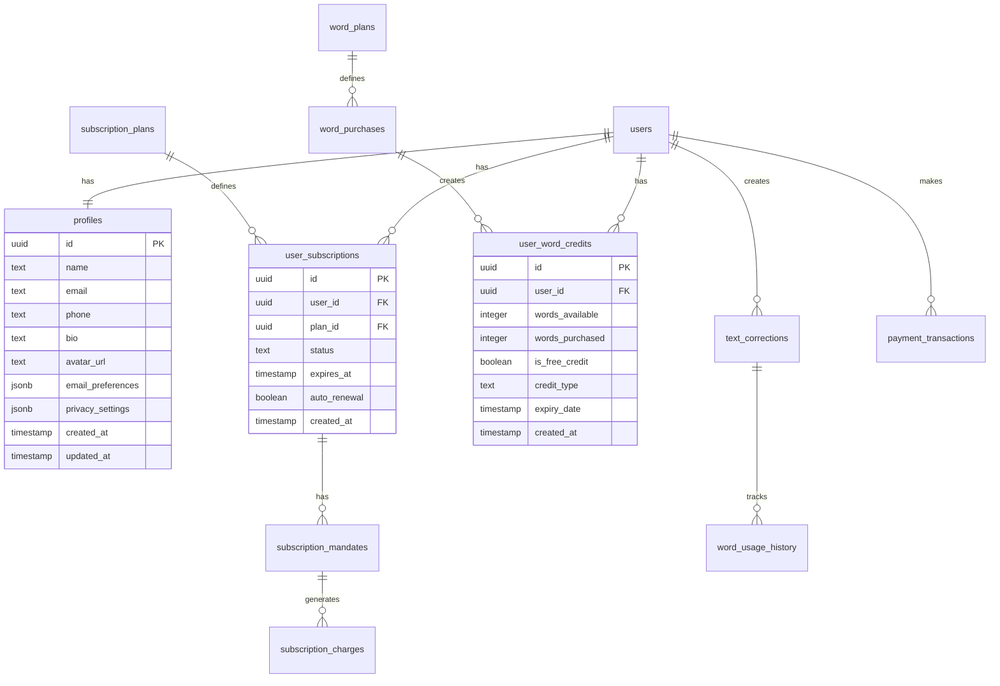
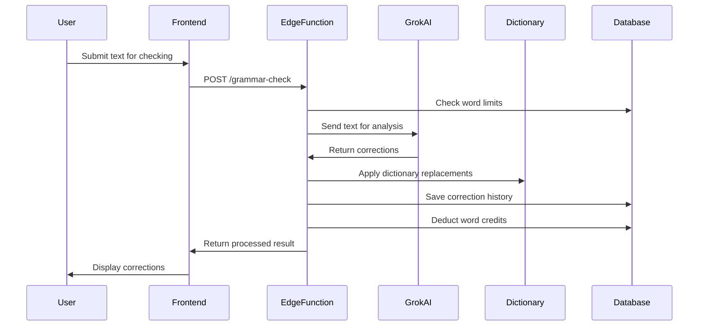
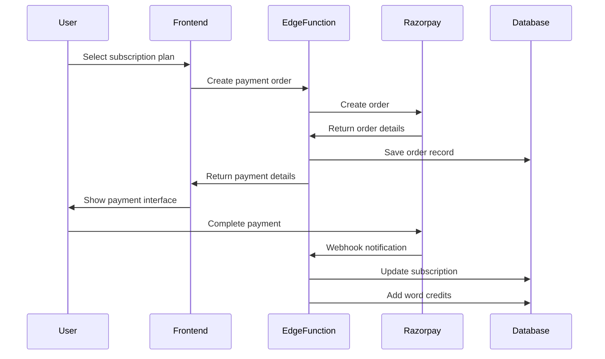

# Vyakarni Technical Architecture

Comprehensive technical documentation of Vyakarni's system architecture, design patterns, and implementation details.

## Table of Contents

1. [System Overview](#system-overview)
2. [Frontend Architecture](#frontend-architecture)
3. [Backend Architecture](#backend-architecture)
4. [Database Design](#database-design)
5. [AI Integration](#ai-integration)
6. [Security Architecture](#security-architecture)
7. [Performance & Scalability](#performance--scalability)
8. [Data Flow](#data-flow)

## System Overview

### High-Level Architecture



### Technology Stack

#### Frontend
- **Framework**: React 18 with TypeScript
- **Build Tool**: Vite 5.x
- **Styling**: Tailwind CSS with custom design system
- **UI Components**: shadcn/ui (Radix UI primitives)
- **State Management**: React hooks and context
- **Routing**: React Router v6
- **Forms**: React Hook Form with Zod validation

#### Backend
- **Backend-as-a-Service**: Supabase
- **Database**: PostgreSQL 15
- **Runtime**: Supabase Edge Functions (Deno)
- **Authentication**: Supabase Auth (JWT-based)
- **File Storage**: Supabase Storage
- **Real-time**: Supabase Realtime

#### External APIs
- **AI Processing**: xAI Grok API
- **Payment Processing**: Razorpay
- **Email Service**: Resend
- **Dictionary Source**: Google Sheets API

### Deployment Architecture

#### Production Environment
- **Frontend Hosting**: Vercel
- **CDN**: Vercel Edge Network
- **Database**: Supabase Cloud
- **Edge Functions**: Supabase Global Network
- **Monitoring**: Built-in Supabase monitoring

#### Development Environment
- **Local Development**: Vite dev server
- **Local Backend**: Supabase CLI (Docker containers)
- **Database**: Local PostgreSQL instance
- **Functions**: Local Deno runtime

## Frontend Architecture

### Component Architecture

```
src/components/
├── ui/                 # Base UI components (design system)
│   ├── button.tsx      # Reusable button component
│   ├── input.tsx       # Form input components
│   ├── dialog.tsx      # Modal and dialog components
│   └── ...
├── feature/            # Feature-specific components
│   ├── GrammarChecker/ # Grammar checking interface
│   ├── Billing/        # Subscription and billing
│   ├── Admin/          # Administrative interface
│   └── ...
├── layout/             # Layout components
│   ├── Header.tsx      # Application header
│   ├── Footer.tsx      # Application footer
│   └── Navigation.tsx  # Navigation components
└── shared/             # Shared components
    ├── LoadingSpinner.tsx
    ├── ErrorBoundary.tsx
    └── ...
```

### State Management Pattern

#### Local State
```typescript
// Component-level state for UI interactions
const [isLoading, setIsLoading] = useState(false);
const [formData, setFormData] = useState<FormData>({});
```

#### Global State
```typescript
// Context for app-wide state
const AuthContext = createContext<AuthContextType>();
const useAuth = () => useContext(AuthContext);
```

#### Server State
```typescript
// React Query for server state management
const { data, error, isLoading } = useQuery({
  queryKey: ['user-profile'],
  queryFn: () => fetchUserProfile(),
});
```

### Design System

#### CSS Architecture
```css
/* src/index.css - Design system foundation */
:root {
  /* Semantic color tokens */
  --primary: 210 40% 98%;
  --primary-foreground: 222.2 84% 4.9%;
  
  /* Component-specific tokens */
  --card: 0 0% 100%;
  --card-foreground: 222.2 84% 4.9%;
}

/* Component base styles */
.btn {
  @apply inline-flex items-center justify-center rounded-md;
}
```

#### Component Variants
```typescript
// Using class-variance-authority for variants
const buttonVariants = cva(
  "inline-flex items-center justify-center rounded-md",
  {
    variants: {
      variant: {
        default: "bg-primary text-primary-foreground",
        destructive: "bg-destructive text-destructive-foreground",
        outline: "border border-input bg-background",
      },
      size: {
        default: "h-10 px-4 py-2",
        sm: "h-9 rounded-md px-3",
        lg: "h-11 rounded-md px-8",
      },
    },
  }
);
```

### Data Flow Pattern

#### API Integration
```typescript
// Service layer pattern
class GrammarService {
  async checkGrammar(text: string): Promise<CorrectionResult> {
    const { data, error } = await supabase.functions.invoke('grammar-check', {
      body: { text }
    });
    
    if (error) throw new Error(error.message);
    return data;
  }
}
```

#### Error Handling
```typescript
// Centralized error handling
const useErrorHandler = () => {
  const handleError = useCallback((error: Error) => {
    console.error('Application error:', error);
    toast({
      title: "Error",
      description: error.message,
      variant: "destructive",
    });
  }, []);
  
  return { handleError };
};
```

## Backend Architecture

### Supabase Edge Functions

#### Function Structure
```typescript
// Edge function template
import { serve } from "https://deno.land/std@0.190.0/http/server.ts";
import { createClient } from "https://esm.sh/@supabase/supabase-js@2";

const corsHeaders = {
  'Access-Control-Allow-Origin': '*',
  'Access-Control-Allow-Headers': 'authorization, x-client-info, apikey, content-type',
};

serve(async (req: Request) => {
  // Handle CORS preflight
  if (req.method === 'OPTIONS') {
    return new Response(null, { headers: corsHeaders });
  }
  
  try {
    // Function logic
    const result = await processRequest(req);
    
    return new Response(JSON.stringify(result), {
      headers: { ...corsHeaders, 'Content-Type': 'application/json' },
    });
  } catch (error) {
    return new Response(JSON.stringify({ error: error.message }), {
      status: 500,
      headers: { ...corsHeaders, 'Content-Type': 'application/json' },
    });
  }
});
```

#### Function Categories

**Grammar Processing Functions**
- `grammar-check` - Basic grammar correction
- `grok-grammar-check` - Advanced AI grammar checking
- `grok-style-enhance` - Style enhancement processing
- `grok-text-comparison` - Text comparison and highlighting

**Payment Processing Functions**
- `razorpay-payment` - Payment order creation and processing
- `subscription-handler` - Subscription management
- `webhook-handler` - Payment webhook processing

**Utility Functions**
- `send-welcome-email` - User onboarding emails
- `sync-dictionary` - Dictionary synchronization
- `auth-webhook` - Authentication event handling

### Database Functions

#### Custom PostgreSQL Functions
```sql
-- User word balance calculation
CREATE OR REPLACE FUNCTION get_user_word_balance(user_uuid uuid)
RETURNS TABLE(total_words_available integer, free_words integer, purchased_words integer)
LANGUAGE plpgsql
SECURITY DEFINER
AS $$
BEGIN
  RETURN QUERY
  SELECT 
    COALESCE(SUM(words_available), 0)::INTEGER as total_words_available,
    COALESCE(SUM(CASE WHEN is_free_credit THEN words_available ELSE 0 END), 0)::INTEGER as free_words,
    COALESCE(SUM(CASE WHEN NOT is_free_credit THEN words_available ELSE 0 END), 0)::INTEGER as purchased_words
  FROM user_word_credits 
  WHERE user_id = user_uuid AND words_available > 0;
END;
$$;
```

#### Trigger Functions
```sql
-- Auto-create user profile on signup
CREATE OR REPLACE FUNCTION handle_new_user()
RETURNS trigger
LANGUAGE plpgsql
SECURITY DEFINER
AS $$
BEGIN
  INSERT INTO public.profiles (id, name, email)
  VALUES (
    NEW.id, 
    COALESCE(NEW.raw_user_meta_data->>'name', NEW.raw_user_meta_data->>'full_name'),
    NEW.email
  );
  RETURN NEW;
END;
$$;
```

## Database Design

### Entity Relationship Overview



### Table Design Patterns

#### Row Level Security (RLS)
```sql
-- Example RLS policy
CREATE POLICY "Users can view their own profiles" 
ON profiles 
FOR SELECT 
USING (auth.uid() = id);

CREATE POLICY "Users can update their own profiles" 
ON profiles 
FOR UPDATE 
USING (auth.uid() = id);
```

#### Audit Logging
```sql
-- Admin action logging
CREATE TABLE admin_audit_logs (
  id uuid PRIMARY KEY DEFAULT gen_random_uuid(),
  admin_id uuid REFERENCES profiles(id),
  action_type text NOT NULL,
  resource_type text NOT NULL,
  resource_id uuid,
  old_values jsonb,
  new_values jsonb,
  ip_address inet,
  user_agent text,
  created_at timestamp with time zone DEFAULT now()
);
```

#### Soft Deletes
```sql
-- Soft delete pattern
ALTER TABLE table_name ADD COLUMN deleted_at timestamp with time zone;

-- View for active records
CREATE VIEW active_records AS 
SELECT * FROM table_name WHERE deleted_at IS NULL;
```

### Data Integrity

#### Constraints
```sql
-- Business logic constraints
ALTER TABLE user_word_credits 
ADD CONSTRAINT positive_words_available 
CHECK (words_available >= 0);

ALTER TABLE subscription_charges 
ADD CONSTRAINT valid_amount 
CHECK (amount > 0);
```

#### Indexes
```sql
-- Performance indexes
CREATE INDEX idx_text_corrections_user_created 
ON text_corrections(user_id, created_at DESC);

CREATE INDEX idx_word_usage_user_date 
ON word_usage_history(user_id, created_at DESC);

-- Partial indexes for active records
CREATE INDEX idx_active_subscriptions 
ON user_subscriptions(user_id) 
WHERE status = 'active';
```

## AI Integration

### Grok AI Integration

#### API Client Design
```typescript
class GrokAIClient {
  private apiKey: string;
  private baseURL: string;
  
  constructor(apiKey: string) {
    this.apiKey = apiKey;
    this.baseURL = 'https://api.x.ai/v1';
  }
  
  async checkGrammar(text: string, options: GrammarCheckOptions): Promise<GrammarResult> {
    const response = await fetch(`${this.baseURL}/chat/completions`, {
      method: 'POST',
      headers: {
        'Authorization': `Bearer ${this.apiKey}`,
        'Content-Type': 'application/json',
      },
      body: JSON.stringify({
        model: 'grok-beta',
        messages: [
          {
            role: 'system',
            content: this.getGrammarSystemPrompt()
          },
          {
            role: 'user',
            content: text
          }
        ],
        temperature: 0.1,
        max_tokens: 4000,
      }),
    });
    
    return this.parseGrammarResponse(await response.json());
  }
  
  private getGrammarSystemPrompt(): string {
    return `
      You are an expert Hindi grammar checker. 
      Analyze the provided Hindi text and return corrections in JSON format.
      Focus on:
      - Grammar errors (व्याकरण की त्रुटियां)
      - Spelling mistakes (वर्तनी की गलतियां)
      - Matra errors (मात्रा की गलतियां)
      - Punctuation issues (विराम चिह्न)
      
      Return format:
      {
        "corrected_text": "corrected version",
        "corrections": [
          {
            "incorrect": "wrong text",
            "correct": "corrected text",
            "reason": "explanation in Hindi",
            "type": "grammar|spelling|punctuation",
            "position": { "start": 0, "end": 10 }
          }
        ]
      }
    `;
  }
}
```

#### Response Processing
```typescript
interface GrammarCorrection {
  incorrect: string;
  correct: string;
  reason: string;
  type: 'grammar' | 'spelling' | 'punctuation' | 'style';
  position?: { start: number; end: number };
  confidence?: number;
}

const processGrammarResponse = (response: GrokResponse): GrammarResult => {
  try {
    const parsed = JSON.parse(response.choices[0].message.content);
    
    return {
      correctedText: parsed.corrected_text,
      corrections: parsed.corrections.map((correction: any) => ({
        ...correction,
        source: 'grok',
        confidence: correction.confidence || 0.9,
      })),
      processingTime: Date.now() - startTime,
    };
  } catch (error) {
    throw new Error('Failed to parse AI response');
  }
};
```

### Dictionary Integration

#### Dictionary Processing Pipeline
```typescript
class DictionaryService {
  async applyDictionary(text: string, dictionary: WordReplacement[]): Promise<string> {
    let processedText = text;
    const appliedReplacements: WordReplacement[] = [];
    
    // Sort by word length (longest first) to avoid partial replacements
    const sortedDictionary = dictionary.sort((a, b) => b.original.length - a.original.length);
    
    for (const replacement of sortedDictionary) {
      const regex = new RegExp(`\\b${this.escapeRegex(replacement.original)}\\b`, 'gi');
      const matches = processedText.match(regex);
      
      if (matches) {
        processedText = processedText.replace(regex, replacement.replacement);
        appliedReplacements.push({
          ...replacement,
          occurrences: matches.length
        });
      }
    }
    
    return {
      processedText,
      appliedReplacements,
      totalReplacements: appliedReplacements.reduce((sum, r) => sum + r.occurrences, 0)
    };
  }
  
  private escapeRegex(string: string): string {
    return string.replace(/[.*+?^${}()|[\]\\]/g, '\\$&');
  }
}
```

#### Dictionary Synchronization
```typescript
// Google Sheets integration for dictionary updates
class DictionarySync {
  async syncFromGoogleSheets(sheetId: string, type: 'grammar' | 'style'): Promise<SyncResult> {
    const response = await fetch(
      `https://sheets.googleapis.com/v4/spreadsheets/${sheetId}/values/Sheet1?key=${this.apiKey}`
    );
    
    const data = await response.json();
    const rows = data.values.slice(1); // Skip header row
    
    const wordReplacements = rows.map((row: string[]) => ({
      original: row[0]?.trim(),
      replacement: row[1]?.trim(),
      dictionary_type: type,
      source: 'google_sheets',
      is_active: true,
    })).filter(item => item.original && item.replacement);
    
    // Batch upsert to database
    const { error } = await supabase
      .from('word_dictionary')
      .upsert(wordReplacements, { 
        onConflict: 'original,dictionary_type',
        ignoreDuplicates: false 
      });
    
    if (error) throw error;
    
    return {
      imported: wordReplacements.length,
      type,
      timestamp: new Date().toISOString()
    };
  }
}
```

## Security Architecture

### Authentication & Authorization

#### JWT Token Management
```typescript
// Supabase Auth integration
const useAuth = () => {
  const [user, setUser] = useState<User | null>(null);
  const [session, setSession] = useState<Session | null>(null);
  
  useEffect(() => {
    // Get initial session
    supabase.auth.getSession().then(({ data: { session } }) => {
      setSession(session);
      setUser(session?.user ?? null);
    });
    
    // Listen for auth changes
    const { data: { subscription } } = supabase.auth.onAuthStateChange(
      (_event, session) => {
        setSession(session);
        setUser(session?.user ?? null);
      }
    );
    
    return () => subscription.unsubscribe();
  }, []);
  
  return { user, session, signIn, signOut, signUp };
};
```

#### Role-Based Access Control
```sql
-- User roles system
CREATE TYPE app_role AS ENUM ('user', 'admin', 'super_admin');

CREATE TABLE user_roles (
  id uuid PRIMARY KEY DEFAULT gen_random_uuid(),
  user_id uuid REFERENCES profiles(id) ON DELETE CASCADE,
  role app_role NOT NULL DEFAULT 'user',
  assigned_by uuid REFERENCES profiles(id),
  assigned_at timestamp with time zone DEFAULT now(),
  UNIQUE(user_id, role)
);

-- Role checking function
CREATE OR REPLACE FUNCTION has_role(_user_id uuid, _role app_role)
RETURNS boolean
LANGUAGE sql
STABLE SECURITY DEFINER
AS $$
  SELECT EXISTS (
    SELECT 1 FROM user_roles
    WHERE user_id = _user_id AND role = _role
  )
$$;
```

#### API Security
```typescript
// Edge function authorization
const authorizeRequest = async (req: Request): Promise<User> => {
  const authHeader = req.headers.get('Authorization');
  if (!authHeader) {
    throw new Error('Authorization header required');
  }
  
  const token = authHeader.replace('Bearer ', '');
  const { data: { user }, error } = await supabase.auth.getUser(token);
  
  if (error || !user) {
    throw new Error('Invalid authorization token');
  }
  
  return user;
};

// Admin-only endpoint protection
const requireAdmin = async (userId: string): Promise<boolean> => {
  const { data, error } = await supabase
    .rpc('has_role', { _user_id: userId, _role: 'admin' });
  
  if (error || !data) {
    throw new Error('Admin access required');
  }
  
  return true;
};
```

### Data Protection

#### Row Level Security (RLS)
```sql
-- Comprehensive RLS policies
ALTER TABLE profiles ENABLE ROW LEVEL SECURITY;

-- Users can only access their own data
CREATE POLICY "users_own_profile" ON profiles
  FOR ALL USING (auth.uid() = id);

-- Admins can access all profiles
CREATE POLICY "admins_all_profiles" ON profiles
  FOR ALL USING (
    EXISTS (
      SELECT 1 FROM user_roles 
      WHERE user_id = auth.uid() 
      AND role IN ('admin', 'super_admin')
    )
  );
```

#### Input Validation
```typescript
// Zod schemas for validation
const grammarCheckSchema = z.object({
  text: z.string()
    .min(1, 'Text is required')
    .max(10000, 'Text too long')
    .refine(text => text.trim().length > 0, 'Text cannot be empty'),
  options: z.object({
    checkSpelling: z.boolean().default(true),
    checkGrammar: z.boolean().default(true),
    checkStyle: z.boolean().default(false),
  }).optional()
});

// Usage in edge function
const validateInput = (input: unknown) => {
  try {
    return grammarCheckSchema.parse(input);
  } catch (error) {
    throw new Error(`Invalid input: ${error.message}`);
  }
};
```

#### Rate Limiting
```typescript
// Simple rate limiting implementation
class RateLimiter {
  private requests = new Map<string, number[]>();
  
  isAllowed(identifier: string, limit: number, windowMs: number): boolean {
    const now = Date.now();
    const requests = this.requests.get(identifier) || [];
    
    // Remove old requests outside the window
    const validRequests = requests.filter(time => now - time < windowMs);
    
    if (validRequests.length >= limit) {
      return false;
    }
    
    validRequests.push(now);
    this.requests.set(identifier, validRequests);
    return true;
  }
}
```

## Performance & Scalability

### Frontend Optimization

#### Code Splitting
```typescript
// Lazy loading for route-based splitting
const GrammarChecker = lazy(() => import('./pages/GrammarChecker'));
const AdminPanel = lazy(() => import('./pages/AdminPanel'));
const Billing = lazy(() => import('./pages/Billing'));

// Component in app
<Suspense fallback={<LoadingSpinner />}>
  <Routes>
    <Route path="/grammar-checker" element={<GrammarChecker />} />
    <Route path="/admin" element={<AdminPanel />} />
    <Route path="/billing" element={<Billing />} />
  </Routes>
</Suspense>
```

#### Memoization Strategy
```typescript
// React.memo for expensive components
const GrammarResult = React.memo<GrammarResultProps>(({ corrections, text }) => {
  return (
    <div>
      {/* Render corrections */}
    </div>
  );
}, (prevProps, nextProps) => {
  return (
    prevProps.corrections.length === nextProps.corrections.length &&
    prevProps.text === nextProps.text
  );
});

// useMemo for expensive calculations
const processedCorrections = useMemo(() => {
  return corrections.map(correction => ({
    ...correction,
    highlighted: highlightText(text, correction)
  }));
}, [corrections, text]);
```

#### Image Optimization
```typescript
// Responsive image component
const OptimizedImage: React.FC<ImageProps> = ({ src, alt, ...props }) => {
  return (
    <picture>
      <source srcSet={`${src}?format=webp`} type="image/webp" />
      <source srcSet={`${src}?format=avif`} type="image/avif" />
      
    </picture>
  );
};
```

### Backend Optimization

#### Database Query Optimization
```sql
-- Optimized queries with proper indexes
CREATE INDEX CONCURRENTLY idx_text_corrections_user_date 
ON text_corrections(user_id, created_at DESC) 
WHERE deleted_at IS NULL;

-- Materialized view for analytics
CREATE MATERIALIZED VIEW user_analytics AS
SELECT 
  user_id,
  COUNT(*) as total_corrections,
  SUM(words_used) as total_words,
  AVG(words_used) as avg_words_per_correction,
  MAX(created_at) as last_correction
FROM text_corrections
WHERE created_at >= CURRENT_DATE - INTERVAL '30 days'
GROUP BY user_id;

-- Refresh strategy
REFRESH MATERIALIZED VIEW CONCURRENTLY user_analytics;
```

#### Caching Strategy
```typescript
// Edge function caching
class CacheManager {
  private cache = new Map<string, { data: any; expires: number }>();
  
  get(key: string): any | null {
    const item = this.cache.get(key);
    if (!item || Date.now() > item.expires) {
      this.cache.delete(key);
      return null;
    }
    return item.data;
  }
  
  set(key: string, data: any, ttlMs: number): void {
    this.cache.set(key, {
      data,
      expires: Date.now() + ttlMs
    });
  }
  
  // Cache dictionary data
  async getDictionary(type: string): Promise<WordReplacement[]> {
    const cacheKey = `dictionary:${type}`;
    let dictionary = this.get(cacheKey);
    
    if (!dictionary) {
      const { data } = await supabase
        .from('word_dictionary')
        .select('*')
        .eq('dictionary_type', type)
        .eq('is_active', true);
      
      dictionary = data || [];
      this.set(cacheKey, dictionary, 5 * 60 * 1000); // 5 minutes
    }
    
    return dictionary;
  }
}
```

### Scalability Considerations

#### Horizontal Scaling
- **Edge Functions**: Auto-scaling with Supabase
- **Database**: Read replicas for read-heavy operations
- **CDN**: Global content distribution via Vercel Edge Network

#### Resource Management
```typescript
// Word usage tracking and limits
const enforceWordLimits = async (userId: string, wordsToUse: number): Promise<boolean> => {
  const { data: balance } = await supabase
    .rpc('get_user_word_balance', { user_uuid: userId });
  
  if (!balance || balance.total_words_available < wordsToUse) {
    throw new Error('Insufficient word credits');
  }
  
  // Deduct words atomically
  const { error } = await supabase
    .rpc('deduct_words', {
      user_uuid: userId,
      words_to_deduct: wordsToUse,
      action_type: 'grammar_check'
    });
  
  if (error) throw error;
  return true;
};
```

## Data Flow

### Grammar Checking Flow



### Payment Processing Flow



This technical architecture provides a comprehensive foundation for understanding Vyakarni's system design and implementation details.